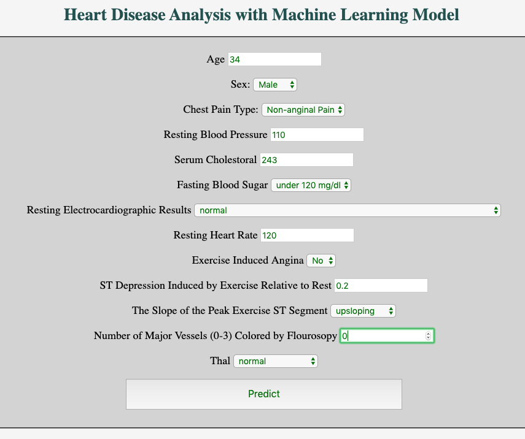

# Machine Learning Demo Deployment 
This is a demo project to show how to make predictions using Machine Learning RandomForestClassifier model and its deployment using Flask API. 
  
### Table of Contents:  
Project has two major parts:
   - _exploration_: This contains jupyter notebook with Heart Disease Data Analysis.
        - _data_: Csv-file with Heart Disease data
        - _model_: Python script with RandomForestClassifier Model and pickled model as a file using pickle.
   - _webapp_: Flask Application with template to make predictions using simple and friendly user interface.
        - _tests_: This contains some test for webapp.

### Installation:
To run this project it is recommended to setup a conda (or virtual) environment by using requirements.txt file.   
```
conda create --name <env> --file <requirements.txt> 
conda activate <your path> 
```
#### Running project:
```
export FLASK_APP=webApp/heart_disease_webapp
flask run
```
and tests: 
```
pytest -v tests/tests.py
```
### Overview


